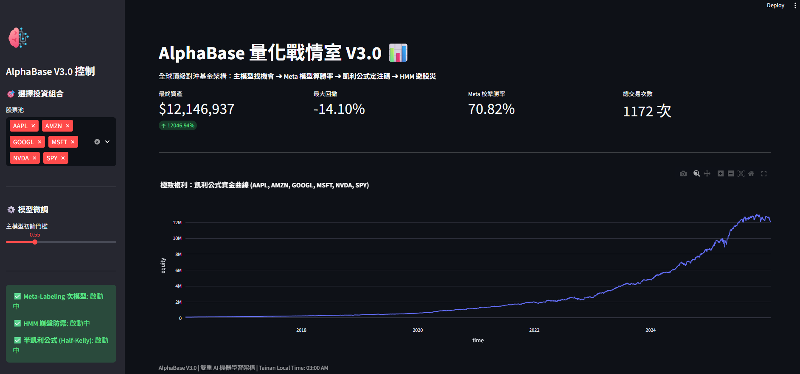

# 📈 AlphaBase V3.0: Walk-Forward Quant Research Prototype


AlphaBase is an event-driven quantitative research prototype. Version 3.0 experiments with a **Primary + Meta-Model** workflow, HMM market-state filtering, and calibration-gated position sizing. These components are research paths, not evidence of a production-ready trading system.

## ✨ Research Architecture

The repository contains four experimental components:

1. **Data Pipeline (PostgreSQL)**
   - **Push-down Computing**: Calculates RSI, Bollinger Bands, moving averages, and returns directly in SQL window functions.
   - **Incremental ETL**: Updates each configured symbol from the last stored date.

2. **Dual-AI Engine (Machine Learning)**
   - **Primary Model (LightGBM)**: Scans the market for Alpha opportunities using the **Triple Barrier Method** and **Purged Time-Series K-Fold** to prevent look-ahead bias.
   - **Meta-Model (Probability Review)**: A secondary model analyzes Primary Model predictions, filters false positives, and writes a calibration report before Kelly sizing is trusted.

3. **Dynamic Risk Management (HMM Market Radar)**
   - Utilizes **Hidden Markov Models (HMM)** to monitor the S&P 500 (SPY).
   - Automatically detects Systemic Crashes and triggers the "Go-to-Cash" protocol, locking all positions and overriding AI buy signals.

4. **Execution & Capital Allocation (Kelly Criterion)**
   - **Calibration-gated sizing**: Uses Half-Kelly only when the saved Meta artifact passes Brier score and expected calibration error limits; otherwise falls back to fixed fractional sizing.
   - **T+1 Realistic Execution**: Simulates live trading environments with T+1 open execution, incorporating 0.1% slippage and commission costs.

## 📊 Reproducible Research Status

The current purged-label report shows that the binary AUC gate did not pass. The ranker beat momentum in 8 of 12 folds, but its mean relative return was lower than momentum, so the internal candidate gate also did not pass. The previously saved Meta-model calibration did not pass its Kelly-sizing limits; the Meta artifact has not yet been rebuilt under the current research ID.

The top-k comparison remains a ranking diagnostic: it uses overlapping forward returns and is not a capital-aware portfolio backtest.

A separate QQQ/GLD inverse-volatility allocation has passed its initial risk-adjusted validation and a short 2024-2025 candidate-specific holdout. It remains a paper-trading candidate rather than proof of persistent alpha; see [`docs/research/portfolio_strategy_report.md`](docs/research/portfolio_strategy_report.md) for the locked protocol, results, and limitations.

The prospective paper portfolio is initialized and advanced with `python scripts/run_paper_portfolio.py`. Its no-retuning and execution rules are documented in [`docs/research/paper_trading.md`](docs/research/paper_trading.md).

Performance claims are intentionally not hard-coded in this README. Publish return, win-rate, and drawdown only from the fixed research protocol:

- Fixed data interval: `2016-01-01` to `2025-12-31`
- Fixed universe: `AAPL, MSFT, NVDA, GOOGL, AMZN, SPY, INTC, PYPL, PFE, ZM`
- Current artifacts: `artifacts/research/alphabase_v3_research_2026_09_purged/`
- Superseded pre-purge artifacts: `artifacts/research/alphabase_v3_research_2026_05/`
- Required validation: walk-forward / rolling retrain folds plus Meta calibration report
- Report path: `docs/research/backtest_report.md`

Generate or refresh the report with:

```bash
python3 scripts/generate_research_report.py
```

### 🖥️ Interactive Dashboard



## 🚀 How to Run (本地運行)

1. **Install dependencies**:
```bash
   pip install -r requirements.txt
```
2. **Setup environment and database**:
```bash
cp .env.example .env
docker compose up -d
```

The defaults in `.env.example` match `docker-compose.yml`. Override `DB_USER`, `DB_PASSWORD`, `DB_HOST`, `DB_PORT`, and `DB_NAME` for other PostgreSQL/TimescaleDB instances.

3. Run ETL & Train the "Three Brains":

```bash
python3 src/data_loader.py
python3 scripts/run_walk_forward_research.py
python3 src/quant_engine.py  # Train Primary AI
python3 src/meta_engine.py   # Train Meta AI and save its threshold
python3 src/hmm_engine.py    # Train Macro HMM
python3 scripts/generate_research_report.py
```
4. Launch the Quant Dashboard:

```bash
streamlit run src/app.py
```

5. Run checks:
```bash
python3 -m compileall src
python3 -m pytest
```

## 🔮 Future Work
[ ] Connect with Interactive Brokers (IBKR) API for live automated execution.

[ ] Incorporate Alternative Data (VIX, Put/Call Ratio, Crypto On-chain Data) into the HMM radar.


## 📝 Theory: Triple Barrier Method
本專案採用 Marcos López de Prado 提出的標註法。對於每一個觀測點 $t$，我們定義三個邊界：
1.  **Upper Barrier (Profit Taking)**:  
    $$P_t \cdot (1 + \sigma_t \cdot M_{pt})$$
2.  **Lower Barrier (Stop Loss)**:  
    $$P_t \cdot (1 - \sigma_t \cdot M_{sl})$$
3.  **Vertical Barrier (Time)**:  
    $$t + \text{days}$$

其中 $\sigma_t$ 為動態波動率，$M$ 為乘數。

標籤 $Y_i$ 根據價格路徑 $P_{t \to T}$ **首先觸碰到**的邊界決定。實作目前使用二元分類：上方邊界為 `1`；下方邊界或到期未勝出為 `0`。

$$
Y_i = \begin{cases}
1 & \text{if touches Upper Barrier first (Win)} \\
0 & \text{if touches Lower Barrier first or times out}
\end{cases}
$$
## 📬 Contact
- Author: Willy Tsai
- Email: Willy100693@gmail.com
- LinkedIn: www.linkedin.com/in/維宸-蔡-812275214
