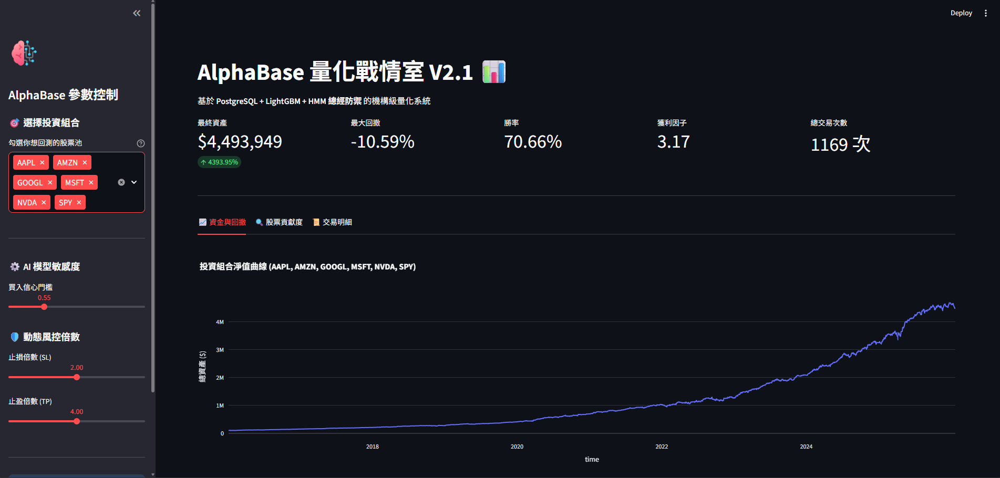

# 📈 AlphaBase: Institutional Quant Trading System (V2.1)


AlphaBase is an event-driven, institutional-grade quantitative trading system designed for multi-asset portfolios. It integrates **PostgreSQL** for high-performance data engineering, **LightGBM** for Alpha generation, and **Hidden Markov Models (HMM)** for macro-level risk management.

## ✨ System Architecture (系統架構)

The system adopts a "Push-down Computing" and modularized architecture:

1. **Data Engineering (PostgreSQL + Python)**
   - **Infrastructure as Code (IaC)**: Automated schema initialization, indexing, and primary key constraints.
   - **Incremental ETL**: Daily updates with < 10 seconds execution time.
   - **SQL Feature View**: Utilizes Window Functions to calculate technical indicators (RSI, MA, Bollinger Bands) directly within the database, reducing Python memory consumption by 90%.

2. **AI Engine (Machine Learning)**
   - **Triple Barrier Method**: Path-dependent dynamic labeling based on market volatility.
   - **Purged K-Fold Cross Validation**: Strictly eliminates "Look-ahead Bias" during model evaluation.
   - **Bayesian Optimization**: Optuna-driven hyperparameter tuning.

3. **Execution & Risk Management**
   - **T+1 Realistic Execution**: Signals generated at $T_{close}$ are executed at $T+1_{open}$, including 0.1% slippage and commission costs.
   - **HMM Market Radar**: Identifies market crashes and automatically triggers the "Go-to-Cash" mechanism to protect capital.
   - **Kelly Criterion**: Dynamic position sizing (10% - 25%) based on AI confidence.

## 📊 Backtest Performance (回測績效)

Under rigorous conditions (No Look-ahead Bias, T+1 Execution, Transaction Costs Included), the portfolio composed of tech giants (AAPL, MSFT, NVDA) demonstrated exceptional resilience.

- **Total Return**: 1241.31%
- **Sharpe Ratio**: 2.48
- **Max Drawdown**: -12.70% (Successfully suppressed by HMM logic)
- **Win Rate**: 65.22%

### 🖥️ Interactive Dashboard


## 🚀 How to Run (本地運行)

1. Install dependencies:
```bash
   pip install -r requirements.txt
 ```
2. Configure your PostgreSQL credentials in config.py.

3. Fetch data and train models:
```bash
    python src/data_loader.py
    python src/quant_engine.py
    python src/hmm_engine.py
```
4. Launch the Dashboard:
```bash
streamlit run src/app.py
```

## 🔮 Future Work

[ ] Implement Meta-Labeling for dual-model calibration.

[ ] Connect with Interactive Brokers (IBKR) API for live automated trading.

---

## 📝 Theory: Triple Barrier Method
本專案採用 Marcos López de Prado 提出的標註法。對於每一個觀測點 $t$，我們定義三個邊界：
1.  **Upper Barrier (Profit Taking)**:  
    $$P_t \cdot (1 + \sigma_t \cdot M_{pt})$$
2.  **Lower Barrier (Stop Loss)**:  
    $$P_t \cdot (1 - \sigma_t \cdot M_{sl})$$
3.  **Vertical Barrier (Time)**:  
    $$t + \text{days}$$

其中 $\sigma_t$ 為動態波動率，$M$ 為乘數。

標籤 $Y_i$ 根據價格路徑 $P_{t \to T}$ **首先觸碰到**的邊界決定：

$$
Y_i = \begin{cases} 
1 & \text{if touches Upper Barrier first (Win)} \\
-1 & \text{if touches Lower Barrier first (Loss)} \\
0 & \text{if touches Vertical Barrier (Time out)}
\end{cases}
$$
## 📬 Contact
- Author: Willy Tsai
- Email: Willy100693@gmail.com
- LinkedIn: www.linkedin.com/in/維宸-蔡-812275214